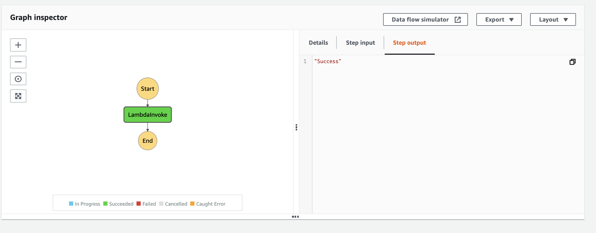

# Serverless AWS Ruby Step Functions with the callback example

Serverless project example which uses AWS `Step Functions` with the `callback`.
Serverless project example which uses Step Functions `taskToken` to pause a workflow until the `taskToken` will be returned. It's a callback pattern. `AWS Lambda` and `Step Functions` were used. 

## Diagram


## Setup

`npm install` to install all needed packages.

## Deployment

In order to deploy the service run:

```bash
sls deploy
```

for deploying with a specific `profile` (located in `~/.aws/credentials`) you can simply use the command:

```bash
AWS_PROFILE=YOUR_PROFILE_NAME sls deploy
```

for deploying to the specific stage, let's say `staging` do:

```bash
sls deploy --stage staging
```

The expected result should be similar to:

```bash
Serverless: Running "serverless" installed locally (in service node_modules)
Serverless: Packaging service...
Serverless: Excluding development dependencies...
Serverless: Clearing previous build ruby layer build
[ '2.2' ]
Serverless: Installing gem using local bundler
Serverless: Zipping the gemfiles to aws-ruby-sf-callback/.serverless/ruby_layer/gemLayer.zip
Serverless: Configuring Layer and GEM_PATH to the functions
✓ State machine "MyCallback" definition is valid
Serverless: Creating Stack...
Serverless: Checking Stack create progress...
........
Serverless: Stack create finished...
Serverless: Uploading CloudFormation file to S3...
Serverless: Uploading artifacts...
Serverless: Uploading service aws-ruby-step-functions-with-callback.zip file to S3 (136 KB)...
Serverless: Uploading service gemLayer.zip file to S3 (506.18 KB)...
Serverless: Validating template...
Serverless: Updating Stack...
Serverless: Checking Stack update progress...
........................
Serverless: Stack update finished...
Service Information
service: aws-ruby-step-functions-with-callback
stage: dev
region: us-east-1
stack: aws-ruby-step-functions-with-callback-dev
resources: 9
api keys:
  None
endpoints:
  None
functions:
  send-token: aws-ruby-step-functions-with-callback-dev-send-token
layers:
  gem: arn:aws:lambda:YOUR-REGION-HERE:XXXXXXXXXXX:layer:aws-ruby-step-functions-with-callback-dev-ruby-bundle:1
```

## Usage

After the deployment, go to the AWS Dashboard, and enter Step Functions page. You will see a newly created state machine.

Open the  `MyCallback` state machine and click on `Start Execution`. Provide empty payload (`task_token` will be generated automatically by the AWS Step Functions).

The success and failure status are generated randomly, so sometimes you need a couple of executions to be run.

### Success




### Failure


## Log retention

The log retention is setup for 30 days. To change it simply change the value of this attribute in the `serverless.yml` file:


``` bash
logRetentionInDays: 30
```

## Structure

| Path                                          | Explanation                                                                                                                                                     |
|-----------------------------------------------|-----------------------------------------------------------------------------------------------------------------------------------------------------------------|
| `./src`                                       | All code for the project.                                                                                                                                       |
| `./src/handlers/send_token`                   | Handler for lambda.                                                                                                                                             |
| `./src/common/`                               | Space for common, reusable pieces of code.                                                                                                                      |
| `./src/common/adapters/step_functions_adapter.rb`        | Adapter for the AWS Step Functions with the usage of AWS SDK for Ruby. Only used for sending success and failure task_token.                                                                    |
| `./src/common/services/send_task_token_service.rb` | The service object pattern is widely used within ruby/rails developers. A class that is responsible for doing only one thing. In our case is handling task token. |

## Serverless plugin

For this example, there is one serverless plugins used:

| Plugin                | Explanation                                                               |
|-----------------------|---------------------------------------------------------------------------|
| [serverless-ruby-layer](https://www.npmjs.com/package/serverless-ruby-layer) | For bundling ruby gems from Gemfile and deploys them to the lambda layer. |
| [serverless-step-functions](https://www.npmjs.com/package/serverless-step-functions)       | Serverless Framework plugin for AWS Step Functions. |

## Ruby gems

| Gem           | Explanation                                                                                             |
|---------------|---------------------------------------------------------------------------------------------------------|
| `aws-sdk-states` | It's a part of the AWS SDK for Ruby. Used for AWS Step Functions. |

## Remove service

To remove the service do:

```
sls remove
```
And the stack will be removed from the AWS.